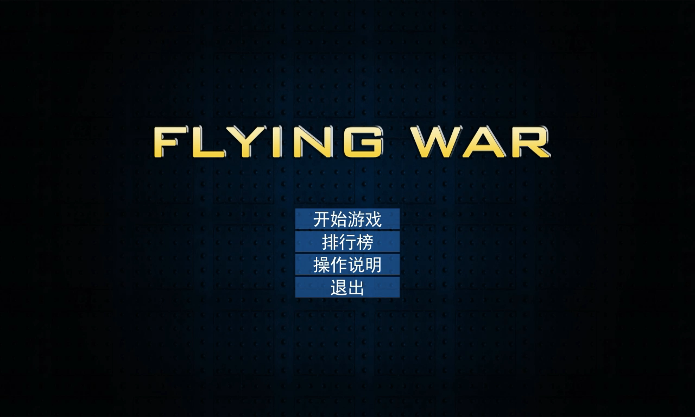
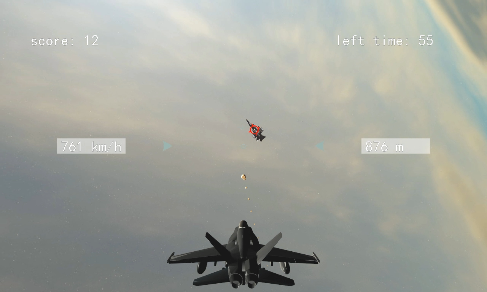
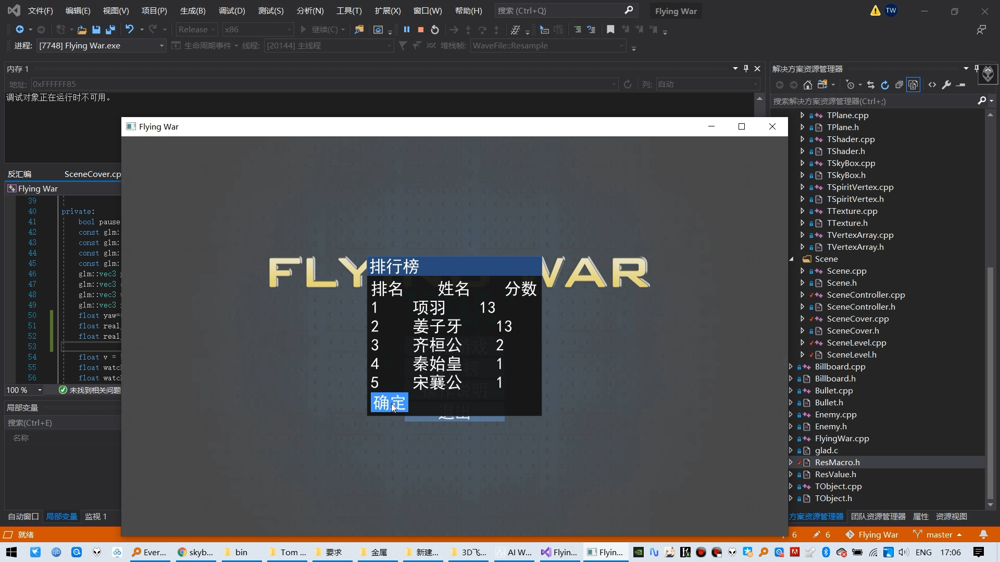

# C++ OpenGL开发的3D打飞机游戏

窗口库用的glfw

界面库用的dear-imgui

模型加载用的assimp

地图用FastNoise库生成的Berlin Noise

通过存储旋转矩阵，把pitch, yaw变化量叠加到旋转矩阵的方法，解决了万向节死锁的问题。

# 下载游戏

https://github.com/tomwillow/FlyingWar/releases/download/v0.1/FlyingWar.v0.1.zip

# 视频

https://www.bilibili.com/video/BV1T5411m77r

# 截图

# 构建须知

因为没有用CMake配置工程，所以环境只能用Windows+Visual Studio 2019。

打开Flying War.sln后，配置需要设置为Debug+x86(依赖库暂时只编译了32位Debug版)。
